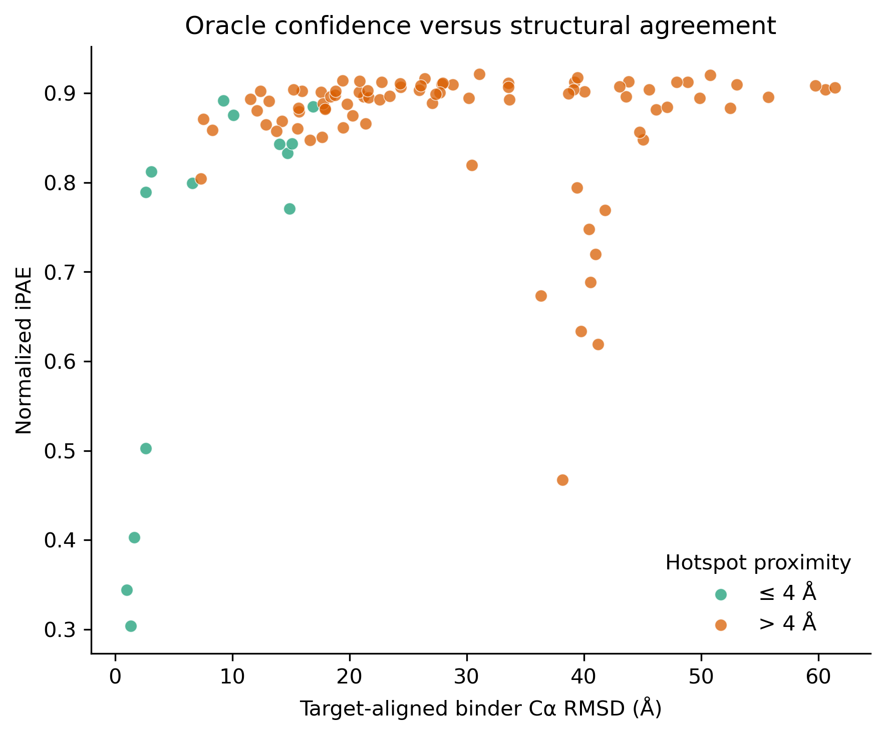

# Background/Scope

Here, I am exploring approaches to get good design at TfR1. My initial definition of a good design is that the oracle prediction has a low RMSD to the diffusion design and that it is confident by AF2 metrics. RFpeptides used iPAE to discriminate designs. I may consider other metrics as well. 

It is difficult to set a "baseline" here as any experiment is highly opinionated, but I will describe my reasoning for the experiments. 

## exp1 

See: `experiments/004_oracle_success/configs/exp1_pipeline.toml`

This experiment mimics the RFpeptides workflow while integrating the SS/ADJ conditioning to target the cropped apical beta strand in 6WRW. Note that due to a off-by-one bug in the tensor calculation code, I supply A210-213, as I do not want to change their code at the moment. After generation of the SS/ADJ tensors, designed to mimic the binding mode observed for 6WRW, for a macrocycle length of 14 (arbitrary at the moment), I diffuse 100 backbones while targeting A209-A212 via hot spot conditioning. I run 4 iterative rounds of ProteinMPNN/Rosetta Relax while allowing only C, D, E or K at the most distal site (calculated by my hueristic). AfCyc is the oracle, and it is given a template of the cropped 6WRW chain A. Six "recycles" are used. The TOML indicates `5` because the initial forward pass is included in the definition of recycle. The ideal outcome is to get at least 1 design that passes RMSD/iPAE checks. This is likely very difficult, as success rates can still be quite low and target dependent. 

`python scripts/run_pipeline.py --config experiments/004_oracle_success/configs/exp1_pipeline.toml`

11.5 hours! A huge amount of this seemed to be Rosetta, not diffusion or oracle.

There is a minor error in this run, discussed in this [github issue](https://github.com/DKchemistry/tfr1-binder-design/issues/6). 

Briefly, in RFpeptides, the intended workflow is: PeptideCyclizeMover → FastRelax → PeptideCyclizeMover.

My code executed: PeptideCyclizeMover → FastRelax.

PeptideCyclizeMover declares the covalent peptide bond between C-term C=O and N-terminal N and adds constraints on the the C-N distance, the two adjacent bond angles angles, and the terminal CA–C(O)–N–CA torsion. These are used by FastRelax. The second PeptideCyclizeMover then repeats this, the pertubation to the structures coordinates appear small. These are a consequence of the logic that declares covalent bond. From one example: 

* C-terminal carbonyl O moved approximately 0.30 Å
* N-terminal amide H moved approximately 0.03 Å
* N, CA, and C backbone atoms did not move
* No other structural coordinates changed meaningfully

ProteinMPNN uses backbone oxygens coords, so there is some effect even if only the O-C-N-H torsion that differed. I do not think that is invalidating for this run, but I would like to fix it in future runs. It is reasonable to just reimplement the bond declaration, as that is the only thing that matters here, but we can also just run `PeptideCyclizeMover` mover again. It is more faithful to the SI. 

Regardless, we will analyze this output. 

Visually, there are floating binders as before. Some designs look better, such as `_4`. Note: AF2 again renumbers stuff. Now the apical beta strand is 20-25 and it is Chain A. Very frustrating how this changes overtime. 

We get some peculiar designs at times, like `_56` has an internal disulfide. Makes sense why RFpeptides chose to exclude cysteines. The fraction of designs that look good are very small. Even the ones that look good don't seem close enough to make inter-molecular contacts. 

I plotted iPAE vs RMSD like this:  

```sh
conda run -n biotite python scripts/analyze_rmsd_ipae.py \
  --oracle experiments/004_oracle_success/outputs/exp1/oracle \
  --oracle_binder_ch B \
  --oracle_target_ch A \
  --relaxed experiments/004_oracle_success/outputs/exp1/mpnn_relax \
  --relaxed_binder_ch A \
  --relaxed_target_ch B \
  --round 4 \
  --dpi 300 \
  --hotspot-residues 20-25 \
  --output_dir experiments/004_oracle_success/outputs/exp1/rmsd_ipae_analysis
```

The static plot is plot is below, and interactive plot is here: `experiments/004_oracle_success/outputs/exp1/rmsd_ipae_analysis/rmsd_vs_ipae.html`



There are 4 designs ~ <= 0.5 iPAE and <= 4A from the hot spots. Only 3 of which are ~<= 2A RMSD. 4A proximity is somewhat generous. The success criteria in RFpeptides is more strict typically, here was some example criteria in their initial testing: 

> Four diverse cyclic peptide binders against the same target were generated using RFpeptides, with AfCycDesign iPAE < 0.3 and Cα r.m.s.d. < 1.5 Å between the design model (blue) and AfCycDesign prediction (gold).

rfdiffusion_56 is best design by iPAE and second best by RMSD, while being within 4A. It's has a pretty good/reasonable backbone interaction with the apical beta strands. Perhaps not a classical beta-pair interaction, though. I would could it as a win in a general sense. 

## exp1-continued 

Considering how long RosettaRelax takes, I would really like to avoid using it. One check is too see how the initial ProteinMPNN sequence design performs with the oracle. The exact way I consider "better or worse" will have to ironed out later. 

Pleasingly, we can reuse our current afcyc script, as it can read round_1, which is the initial proteinmpnn assignment (round_2 would be the first one influenced by relaxation).

```sh
time XLA_PYTHON_CLIENT_PREALLOCATE=false \
conda run --no-capture-output -n biopython \
python scripts/run_afcyc_all.py \
  --design-dir experiments/004_oracle_success/outputs/exp1/mpnn_relax \
  --output-dir experiments/004_oracle_success/outputs/exp1-cont \
  --target-pdb data/PDBs/6wrw_ChA_189-383.pdb \
  --target-chain A \
  --params /home/dkouv/alphafold \
  --afcyc-env afcyc \
  --round 1 \
  --recycles 5 \
  --seed 0
```
