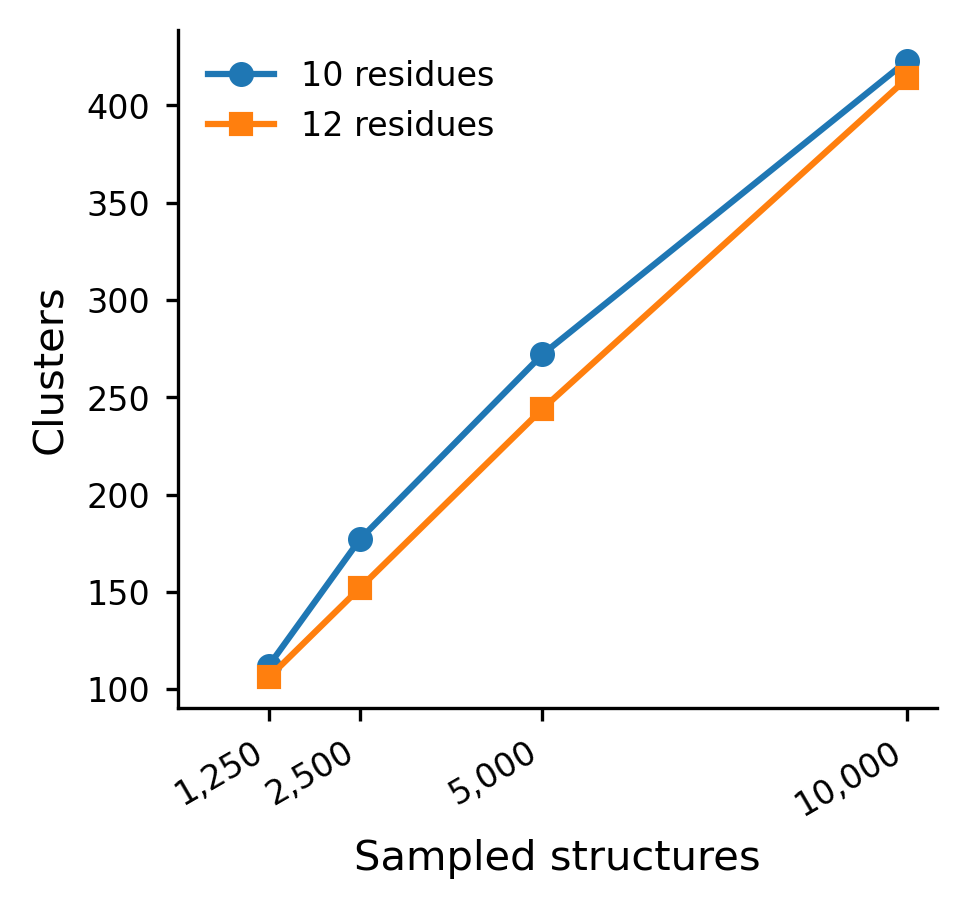
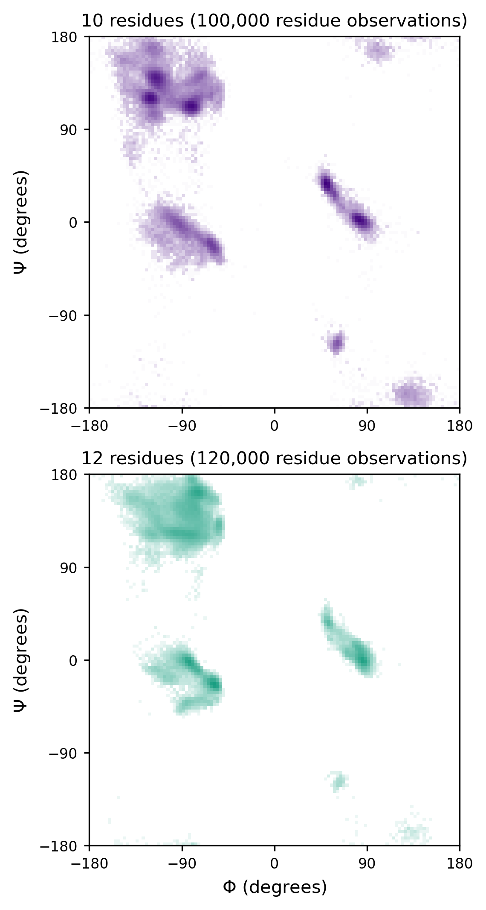
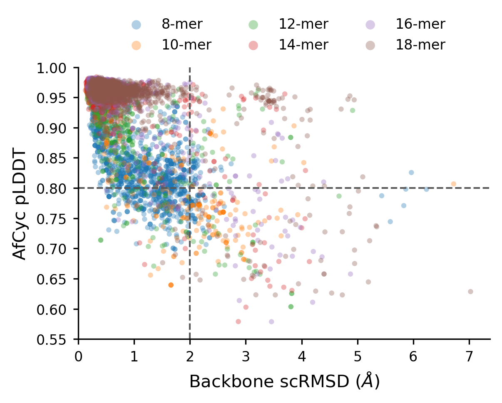
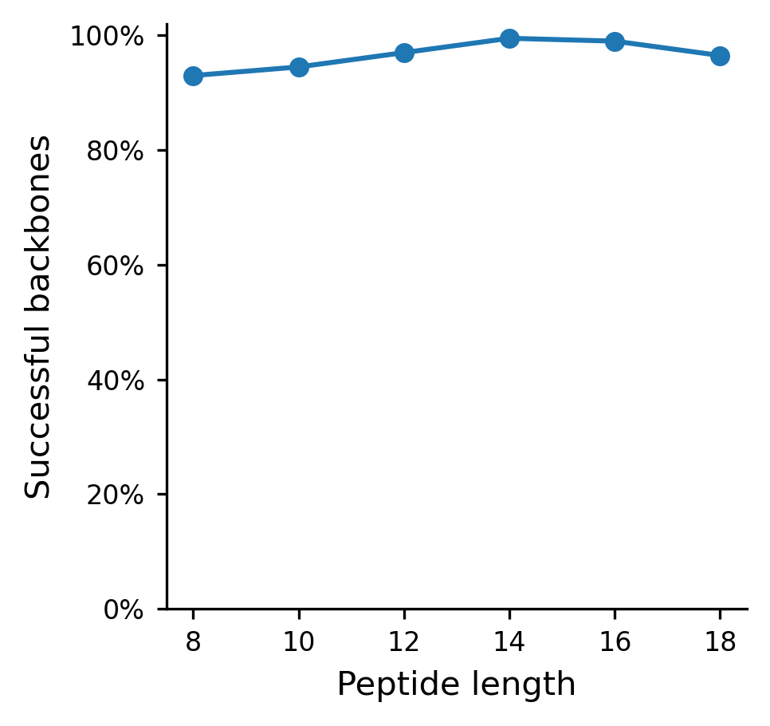
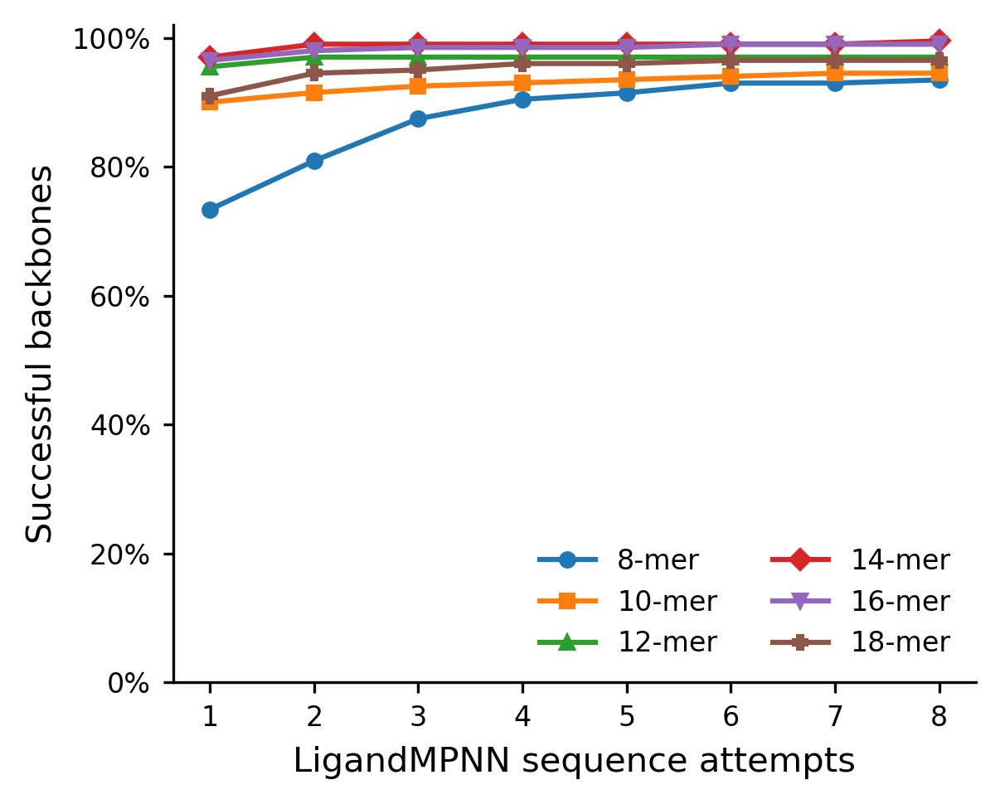
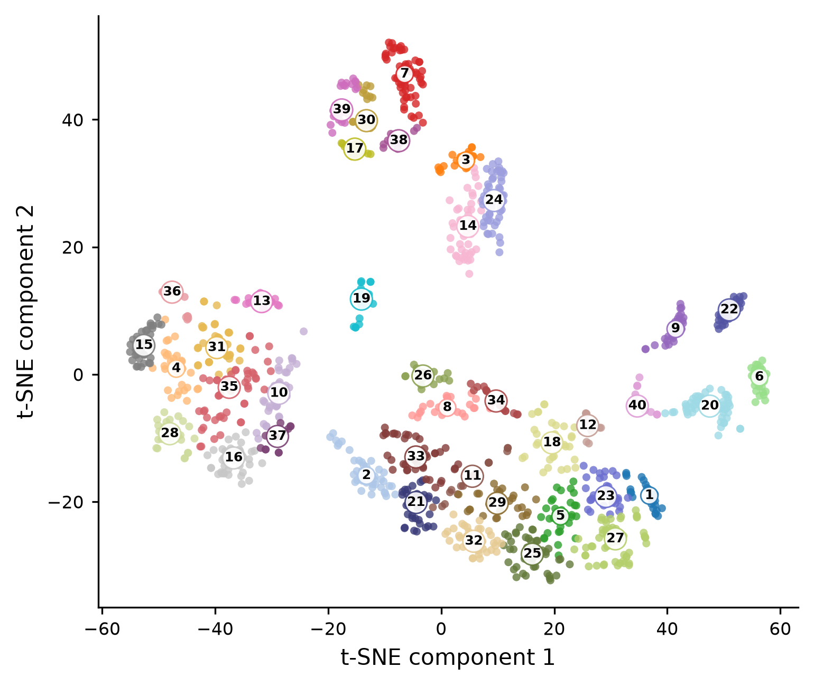

# Background:

This experiment concerns my initial implementation of cyclic positional encoding in RFD3 and testing generation capabilities. 

Repo Link: https://github.com/DKchemistry/foundry/tree/feat/rfd3-cyclic-positional-encoding

Commit SHA: 4bdb42af496f7e77c92a2db85afeb77788ea204b

## Install: 

On my WSL2 system:

```sh
git clone https://github.com/DKchemistry/foundry.git
cd foundry

git fetch origin
git switch feat/rfd3-cyclic-positional-encoding
```

Pin to the inital implementation commit. 

```sh
git checkout 4bdb42af496f7e77c92a2db85afeb77788ea204b
```

Use uv: 

```sh
uv python install 3.12
uv venv --python 3.12
source .venv/bin/activate
uv pip install -e '.[all,dev]'
```
This implementation will be tested with Python 3.12, Torch 2.14.0+cu130, CUDA working on GTX 1660 Ti.

Install checkpoint: 

```sh
foundry install rfd3
```

This was already satisfied.

## Update: Oct 4th, 2026 ~7:30 PM CPH Time 

I updated my implementation of RFD3 to use unique residues to calculate cyclic chain length rather than just counting along the index to match RF3 more closely. This should not affect the downstream results but re-running the analysis is not a bad idea. 

Initial implementation:
4bdb42af496f7e77c92a2db85afeb77788ea204b

Updated CRPE implementation:
69c70a88e0ed7348602ecfcef55d9ee6082cd675

## Test 1: Default monomer and binder design

### Binder/PPI

First, I will assess if my changes affected default behavior in monomer and binder design. 

I will use the [PPI example](https://github.com/RosettaCommons/foundry/blob/production/models/rfd3/docs/examples/protein_binder_design.md) given in the tutorial. 


```sh
# pwd = $HOME/foundry
python "$HOME/foundry/models/rfd3/src/rfd3/run_inference.py" \
  out_dir="$HOME/work/tfr1-binder-design/experiments/007_RFD3_macrocycles/test_1/binder" \
  ckpt_path="$HOME/.foundry/checkpoints/rfd3_latest.ckpt" \
  inputs="$HOME/foundry/models/rfd3/docs/examples/protein_binder_design.json" \
  inference_sampler.step_scale=3 \
  inference_sampler.gamma_0=0.2
```
Log appears normal relative to other runs I have done with RFD3. One potential concern: 

`WARNING:rfd3.model.layers.layer_utils:[rank: 0] Using nn.RMSNorm instead of apex.normalization.fused_layer_norm.FusedRMSNorm.Ensure you're using the correct apptainer`

But I am not sure I introduced this. I will check later. 

Run time is normal on my WSL install, I have run this test previously when installing RFD3.

Run time: 32m 15s

Output is normal by visual inspection in PyMol. Structures appear like reasonable binders. No accidental cyclicity was introduced. 

### Monomer

I made my own monomer example. See: `input_jsons/monomer_design.json`. It requests 20-40 AA monomers and otherwise uses sane defaults. 

```sh
# pwd = $HOME/foundry
python "$HOME/foundry/models/rfd3/src/rfd3/run_inference.py" \
  out_dir="$HOME/work/tfr1-binder-design/experiments/007_RFD3_macrocycles/test_1/monomer" \
  ckpt_path="$HOME/.foundry/checkpoints/rfd3_latest.ckpt" \
  inputs="$HOME/work/tfr1-binder-design/experiments/007_RFD3_macrocycles/input_jsons/monomer_design.json" \
  inference_sampler.step_scale=3 \
  inference_sampler.gamma_0=0.2
```

Run time: 1m 20s

Output is normal by visual inspection in PyMol. Structures appear like reasonable monomers. No accidental cyclicity was introduced. 

## Test 2: Default macrocycle monomer and binder design.

### Monomer 

I am following what was reported in RFpeptides, but scaling down due to compute budget: 

> We added the cyclic positional encoding scheme to RFdiffusion and observed robust generation of diverse macrocyclic peptides (Fig. 1b,c and Supplementary Fig. 2). Similar to the previously described work on designing monomeric cyclic peptides with physics-based methods7 and AfCycDesign11, we observed 9,045 and 8,913 structurally unique 10-residue and 12-residue backbones, respectively, when 48,000 macrocycle backbones were generated for each size (Supplementary Fig. 2). The distribution of phi and psi values in these generated backbones is similar to the standard Ramachandran plot for protein structures (Supplementary Fig. 2), suggesting that generated backbones do not require extensive d-amino acids to stabilize the generated structures7. While we did not attempt to comprehensively enumerate the structural space of cyclic peptide monomers, RFpeptides can readily be scaled up to comprehensively cover the structural space accessible to macrocyclic peptides. 

It can be seen from the figures that folding the inverse design sequences also occured. We already have AFCyc as an oracle on this machine. I first need to see what our throughput and storage requirements are. I will start by making 8 monomers of 10-mers and 12-mers. 

/home/dkouv/foundry/models/rfd3/docs/examples/macrocycle_monomer.json


```sh
# pwd = $HOME/foundry
python "$HOME/foundry/models/rfd3/src/rfd3/run_inference.py" \
  out_dir="$HOME/work/tfr1-binder-design/experiments/007_RFD3_macrocycles/test_2/macrocycle_monomer" \
  ckpt_path="$HOME/.foundry/checkpoints/rfd3_latest.ckpt" \
  inputs="$HOME/foundry/models/rfd3/docs/examples/macrocycle_monomer.json" \
  inference_sampler.step_scale=3 \
  inference_sampler.gamma_0=0.2
```

1m 33s

The macrocycles look visually correct in PyMol, there is N -> C connectivity. 

Let's make 500 of each by setting `diffusion_batch_size` to 500. I am not sure what the difference between that and increasing `n_batches` is. Both lead to more designs overall, but whether they mean scientifically different things I am not sure. I am also not sure about `step_scale` and `gamma`, but these were recommended in binder design. I will ask in the discord or read more.

```sh
python "$HOME/foundry/models/rfd3/src/rfd3/run_inference.py" \
  out_dir="$HOME/work/tfr1-binder-design/experiments/007_RFD3_macrocycles/test_2/macrocycle_monomer_500" \
  ckpt_path="$HOME/.foundry/checkpoints/rfd3_latest.ckpt" \
  inputs="$HOME/foundry/models/rfd3/docs/examples/macrocycle_monomer.json" \
  inference_sampler.step_scale=3 \
  inference_sampler.gamma_0=0.2 \
  diffusion_batch_size=500
```

15m 3s

RFD3 is very fast. I will make 10,000 of each and pause there. That should be enough to get some meaningful signal. It may even be possible to get to 50K (est. 25 hr of compute), but I am not comfortable running that on the laptop. 10,000 should be 5 hours of compute, which is not small. The sampler settings are debateable. The `step_scale=3` and `gamma_0=0.2` are recommended for the designability of binders, but comes at some loss of diversity. The base settings of RFD3 (`step_scale=1.5` and `gamma_0=0.6`) encourage more diversity. I think establishing the baseline is a good initial experiment. I will also use `is_non_loopy=True`. I was likely far too optimistic about RFD3 throughput, though I hope I was wrong. 


```sh
python "$HOME/foundry/models/rfd3/src/rfd3/run_inference.py" \
  out_dir="$HOME/work/tfr1-binder-design/experiments/007_RFD3_macrocycles/test_2/macrocycle_monomer_10k" \
  ckpt_path="$HOME/.foundry/checkpoints/rfd3_latest.ckpt" \
  inputs="$HOME/work/tfr1-binder-design/experiments/007_RFD3_macrocycles/test_2/macrocycle_monomer_10K/macrocycle_monomer_10K.json" \
  diffusion_batch_size=500 \
  n_batches=20
```
4h 52m 18s

This is about 50% VRAM but already 98% GPU util, so further increments of `diffusion_batch_size` may not be offering much more gain.

I can scale more later if required, but I think it is better to try to reproduce the analysis done in the RFpeptides work.

### Binder 

I forgot to run this: 

```sh
cd "$HOME/foundry"

"$HOME/foundry/.venv/bin/python" "$HOME/foundry/models/rfd3/src/rfd3/run_inference.py" \
  out_dir="$HOME/work/tfr1-binder-design/experiments/007_RFD3_macrocycles/test_2/macrocycle_binder_10" \
  ckpt_path="$HOME/.foundry/checkpoints/rfd3_latest.ckpt" \
  inputs="$HOME/foundry/models/rfd3/docs/examples/macrocycle_binder.json" \
  inference_sampler.step_scale=3 \
  inference_sampler.gamma_0=0.2 \
  diffusion_batch_size=10 \
  n_batches=1 \
  +specification.is_non_loopy=true
```
I made the `diffusion_batch_size=10` because I am not sure how rough the memory spike is going to be. It appears stable around 65% memory consumption here during launch. I think it might spike, as I have seen that in the monomer design case. 

~5 min, max VRAM = 66%, for: 1,405 atom positions and 162 residues


### Monomer: Cluster Diversity and Phi/Psi Angles as a Function of Designs 

In RFpeptides, one of the methods used to assess the diversity of design space is by Calpha RMSD clustering. If cluster size grows as a function of designs, we can expect that the method is generating a diversity of Calpha designs. I perform a similar experiment in `experiments/007_RFD3_macrocycles/test_2/macrocycle_monomer_10k/clustering`, but instead using C-backbone RMSD. 

The basic approach is to use cyclic permutations to assign a psuedo-"low energy bin" cluster. Consider a five membered cyclic peptide composed of A1 through A5 and a second five membered cyclic peptide composed of B1 through B5. We perform the superposition and calculate RMSD of A1-A5 onto B1-B2-B3-B4-B5, B2-B3-B4-B5-B1, B3-B4-B5-B1-B2, etc etc. Imagine one permutation of B produces an RMSD < 0.5A, A and B then become members of the same cluster. We try A1-A5 against permutations of C1-C5, we do not need to try B onto C as it already belongs in the first cluster with A. C may not have a permutation that meets our threshold, so instead we begin using C to define cluster 2 and align it to D, this process repeats until we have evaluated every potential cluster representative. If designs are sampling diverse C-backbone RMSDs, we expect clusters to increase monotonically with design size. That is indeed what we see: 



Relevant code: `experiments/007_RFD3_macrocycles/scripts/cluster_macrocycle_backbones.py`
Relevant code: `experiments/007_RFD3_macrocycles/scripts/plot_macrocycle_clustering.py`

That does not, in and of itself, guarantee anything about the reasonability of the backbones. So, our next experiment is to calculate the Phi/Psi angle distributions of our designs to assess whether we are sampling reasonable conformational space. This is, to me, still mostly a qualitative check. 



Relevant Code: `experiments/007_RFD3_macrocycles/scripts/calculate_macrocycle_torsions.py`
Relevant Code: `experiments/007_RFD3_macrocycles/scripts/plot_macrocycle_ramachandran.py`

### Monomer Self Consistency 

A critical aspect of many backbone/inverse design methods is evaluation by an oracle. If the designed backbone and predicted sequence can be independently folded in the forward direction by a performant structure prediction method (e.g. AF2), the design is considered successful (by *in silico* standards). This is sometimes called "self consistency". I approximate the some of the *in silico* analyses of monomeric cyclic peptide generation/self consistency reported by RFpeptides here. In their report, this is mostly covered in S2.    

See: `/experiments/007_RFD3_macrocycles/monomer_self_consistency`

In RFp, a design is considered successful if the oracle and backbone have an scRMSD < 2.0 Å and the oracle has an average pLDDT > 0.8 for any of the 8 inverse folds generated by LigandMPNN. scRMSD is "self consistency" RMSD and generally refers to either the Calpha or backbone RMSD between design and oracle. pLDDT, or predicted local distance difference test, is a *local*, *per residue* confidence metric predicted by ∑AlphaFold2. Generally speaking, it gauges how confident AlphaFold2 is about that particular residue contextually to its near neighbors but does not extend to more distal portions of the structure. While it should be noted that these are only predictions, hueristics in the field suggest >80 pLDDT, or in some cases only greater than >70, is indicative of accurate backbone assignment, whereas >90 may suggest correct side chain orientation. These are debateable ranges and AF2 is an imperfect oracle even when highly confident. Another common use of pLDDT is its average across all residues in a prediction, a  "global confidence". I report linearly scaled values between 0 and 1 as opposed to 0 to 100.

To generate the data needed for various self consistency measurements made between design and oracle, I followed the RFp workflow. I generated 200 designs of 8/10/12/14/16/18-mers using default RFD3 settings in monomer macrocycle mode, yielding 1,200 total. Inverse folding was performed via LigandMPNN at a temperature of 0.1 with 8 assignments per design, yielding 9,652 sequence predictions per backbone. Eight are missing as one LigandMPNN assignment failed, presumably due to poor geometry in RFD3, this is dropped from subsequent analysis. AfCycDesign was used as the oracle using previously described settings, notably with one forward pass, 6 recycles, and all five pTM models. 

More detailed methods/settings are available in the associated scripts: 

RFD3 cyclic backbone generation:
`experiments/007_RFD3_macrocycles/scripts/run_rfd3_monomer_self_consistency.sh`

LigandMPNN Inverse Folding: 
`experiments/007_RFD3_macrocycles/scripts/run_ligandmpnn_monomer_self_consistency.sh`, which calls `experiments/007_RFD3_macrocycles/scripts/prepare_ligandmpnn_inputs.py`.

AF2CycDesign: `experiments/007_RFD3_macrocycles/scripts/run_afcyc_monomer_self_consistency.sh`, which calls: `experiments/007_RFD3_macrocycles/scripts/run_afcyc_monomer_predictions.py`. 

*Note to self: remember JAX compilation issue before binder predictions. Without it, JAX tries to reserve 4GB of VRAM.*

NOTE: One LigandMPNN assignment did not work, its noted on my GitHub Issues. 

**Self-consistency suspiciously good.** Either there was a methodological flaw in my approach or a bug I haven't noticed in the code so far. These results are hard to believe. An overwhelming majority of the designs are successful. Even with a single sequence decoration attempt in the 8-mer condition we are >70%. This is dramatically higher than what is reported by RFpeptides. 

The data generated by the pipeline is plotted here: `experiments/007_RFD3_macrocycles/scripts/plot_afcyc_monomer_self_consistency.py`.

Giving:



`experiments/007_RFD3_macrocycles/monomer_self_consistency/analysis/run_01/figures/afcyc_plddt_vs_backbone_rmsd.png`



`experiments/007_RFD3_macrocycles/monomer_self_consistency/analysis/run_01/figures/afcyc_success_by_length.png`



`experiments/007_RFD3_macrocycles/monomer_self_consistency/analysis/run_01/figures/afcyc_success_by_sequence_attempts.png`

### GMM Clustering on t-SNE of N x N TM-Align Scores.

RFp performs GMM clustering of t-SNE projections built from a symmetric matrix of TM-Align scores. This is one way to evaluate the diversity of the designs. The TM-Align scores of A to B is averaged with B to A. We end up generating a matrix like this:

|       | **A** | **B** | **C** | **D** | **E** |
|:-----:|:-----:|:-----:|:-----:|:-----:|:-----:|
| **A** | 1 | AB | AC | AD | AE |
| **B** | AB | 1 | BC | BD | BE |
| **C** | AC | BC | 1 | CD | CE |
| **D** | AD | BD | CD | 1 | DE |
| **E** | AE | BE | CE | DE | 1 |

We do the calculation here: `experiments/007_RFD3_macrocycles/scripts/compute_macrocycle_tmalign_matrix.py`

And we plot here: `experiments/007_RFD3_macrocycles/scripts/plot_macrocycle_structural_tsne.py`.



